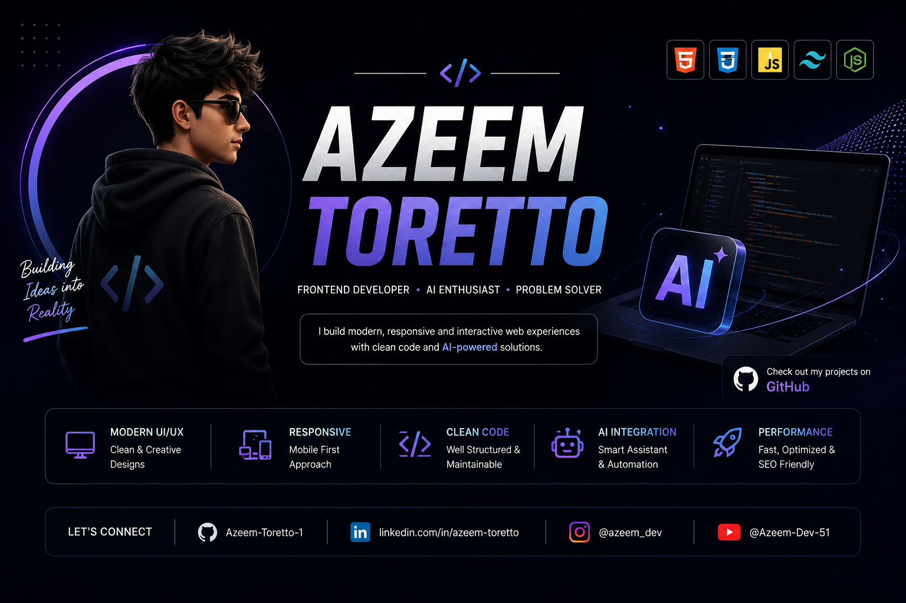
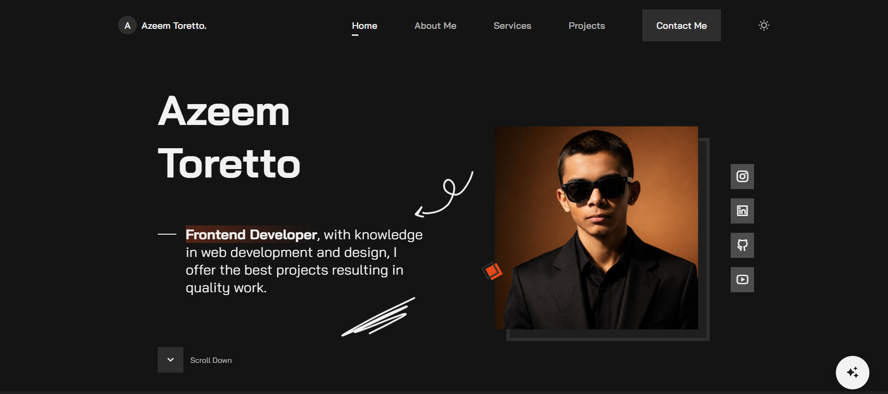
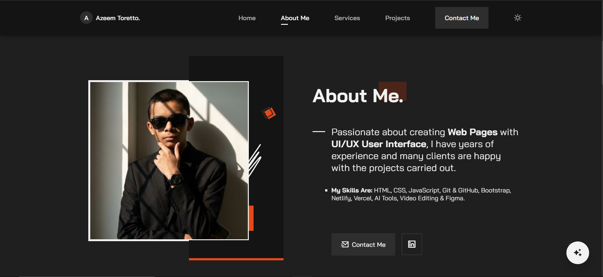
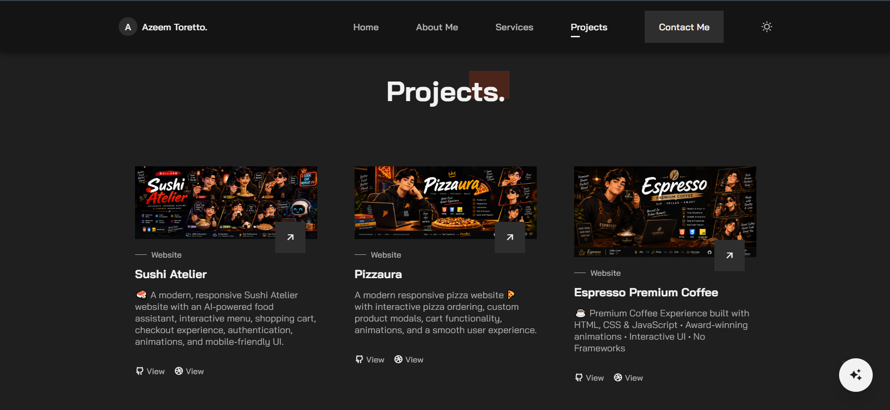
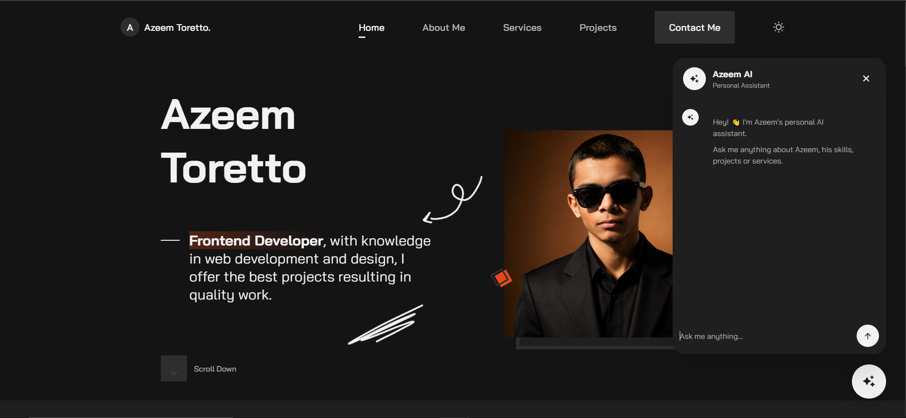

<p align="center">
  
</p>

# 🚀 Azeem Malik — Developer Portfolio

A modern, responsive and interactive **developer portfolio website** built to showcase my skills, projects, services, and web development journey.

The portfolio also features an integrated **AI-powered personal assistant — Azeem AI**, allowing visitors to ask questions about my skills, projects, services, and experience.

## 🌐 Live Portfolio

👉 **Live Website:** https://azeem-portfolio-ai.netlify.app

## 🤖 Azeem AI

Meet **Azeem AI**, my personal AI portfolio assistant.

Visitors can ask questions such as:

* 👨‍💻 What technologies does Azeem use?
* 🚀 What projects has Azeem built?
* 🛠️ What services does Azeem offer?
* 📂 Where can I find Azeem's GitHub?
* 📱 How can I contact Azeem?

The AI assistant is powered by **Google Gemini API** and is securely integrated through a serverless backend.

## ✨ Features

* 🎨 Modern and clean UI
* 📱 Fully responsive design
* 🌙 Dark / Light mode
* 🤖 AI-powered portfolio assistant
* 🚀 Interactive project showcase
* 💼 Services section
* 📩 Contact section
* 🔗 Social media integration
* ✨ Smooth animations
* 🖱️ Custom cursor
* 📱 Mobile-friendly navigation
* ⚡ Fast and lightweight frontend

## 🛠️ Tech Stack

* HTML5
* CSS3
* JavaScript
* Remix Icons
* ScrollReveal.js
* EmailJS
* Google Gemini API
* Netlify Functions
* Git & GitHub

## 📂 Featured Projects

Some of my featured projects include:

* 🍣 **Sushi Atelier** — Modern Japanese restaurant website with interactive UI and AI-powered food assistant.
* 🍕 **Pizzaura** — Interactive pizza ordering website with cart functionality and product interactions.
* ☕ **Espresso Premium Coffee** — Premium coffee website with modern UI and animations.
* ☁️ **CloudAura** — Responsive weather application for checking real-time weather information.
* 🧠 **QuizVerse** — Interactive frontend quiz application with multiple difficulty levels, dark mode and quiz statistics.

## 📸 Portfolio Preview

Screenshots of the portfolio are available inside:

```text
assets/screenshots/
```

## 📸 Portfolio Screenshots

<p align="center">
  
</p>

<p align="center">
  
</p>

<p align="center">
  
</p>

<p align="center">
  
</p>

---

## 📁 Project Structure

```text
Portfolio/
│
├── assets/
│   ├── css/
│   ├── img/
│   ├── js/
│   └── screenshots/
│
├── netlify/
│   └── functions/
│       └── ai.js
│
└── index.html
```

## 🔐 AI Security

The Gemini API key is **not exposed in the frontend**.

The AI request is handled through a Netlify serverless function using an environment variable:

```text
GEMINI_API_KEY
```

This keeps the API key out of the public source code.

## 📬 Connect With Me

### GitHub

https://github.com/Azeem-Toretto-1

### LinkedIn

https://www.linkedin.com/in/azeem-toretto

### Instagram

https://www.instagram.com/azeem_dev

### YouTube

https://www.youtube.com/@Azeem-Dev-51

## 🎯 Goal

My goal is to build **modern, responsive and interactive web experiences** while continuously improving my frontend development and AI integration skills.

## ⭐ Support

If you like this portfolio, consider giving the repository a ⭐ on GitHub.

---

### 👨‍💻 Azeem Malik

**Frontend Developer | HTML • CSS • JavaScript • AI**

Built with ❤️ and lots of code.
